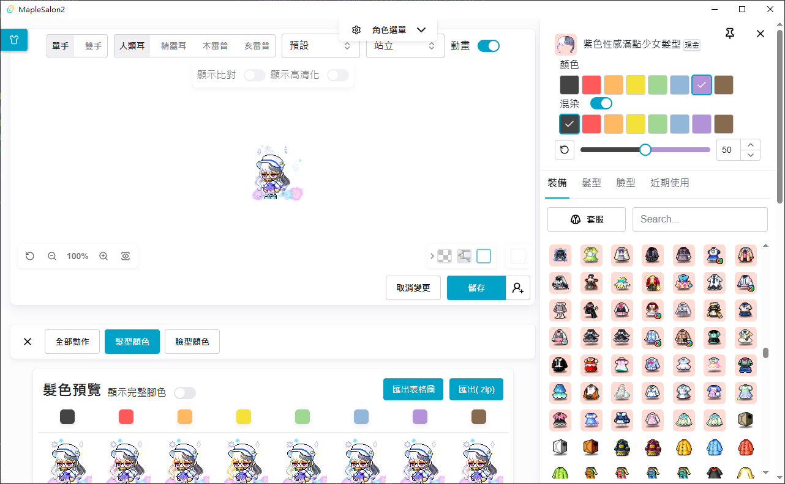

# MapleSalon2
Salon Simulator for Maplestory, preview all of hair cut or eyes color and all mix dye recipe.

Now also able to simulate item dye! and preview all action.

## Screenshot

## Download
All download avaiable at [Releases page](./releases).

Installer will only check `Webview` and extract the app exe to desire folder, fell free to move it anywhere.

## Support Languages

- English
- 繁體中文

## Questions

- [English](./doc/questions-en_us.md)
- [繁體中文](./doc/questions-zh_tw.md)

## 

## Build it manually
Make sure you have environment below.
- Rust 1.70.0 or higher
- Node.js 16 or higher

then
> npm run tauri build